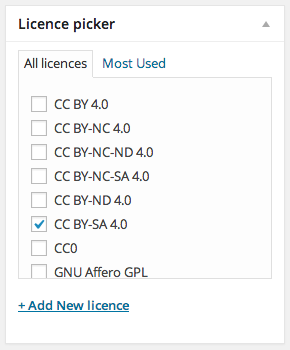

licence-picker
==============

Defines a licence taxonomy, so editors can set licences on a post-by-post basis. Prints the licencing meta tag. Use it for Creative Commons, GNU GPL etc.

* *Contributors:* Júlio Reis
* *Tags:* licensing, GPL, Creative Commons, metadata
* *Requires at least:* 3.0.0
* *Tested up to:* 3.8.1
* *Stable tag:* 0.0.1
* *License:* GPLv3
* *License URI:* [http://www.gnu.org/licenses/gpl-3.0.html](http://www.gnu.org/licenses/gpl-3.0.html) or see the included `LICENSE.txt` and `LICENSE.md`

Description
-----------

Defines a `licence` custom taxonomy. The licence info should be registered in this way:

* short name as `name` attribute (what you input when you create a licence from Add New Post / Edit Post)
* long name, followed by a space, followed by the licence’s URL as `description` attribute (accessible in the _Posts > Licences_ admin menu)

Then just pick the licences you need from the taxonomy box:

### Tested with

* [Polylang](http://polylang.wordpress.com/) – just turn on translations for the `licence` taxonomy under _Settings > Languages > Settings > Custom taxonomies_

### Suggested licences

These are some licences to get you started.

* `name` : `description`
* CC0 : Public Domain Dedication http://creativecommons.org/publicdomain/zero/1.0/
* CC BY 4.0 : Creative Commons Attribution 4.0 International http://creativecommons.org/licenses/by/4.0/
* CC BY-SA 4.0 : Creative Commons Attribution-ShareAlike 4.0 International http://creativecommons.org/licenses/by-sa/4.0/
* CC BY-ND 4.0 : Creative Commons Attribution-NonCommercial-ShareAlike 4.0 International http://creativecommons.org/licenses/by-nd/4.0/
* CC BY-NC 4.0 : Creative Commons Attribution-NonCommercial 4.0 International http://creativecommons.org/licenses/by-nc/4.0/
* CC BY-NC-SA 4.0 : Creative Commons Attribution-NonCommercial-ShareAlike 4.0 International http://creativecommons.org/licenses/by-nc-sa/4.0/
* CC BY-NC-ND 4.0 : Creative Commons Attribution-NonCommercial-NoDerivatives 4.0 International http://creativecommons.org/licenses/by-nc-nd/4.0/
* GNU GPL : GNU General Public License v3 http://www.gnu.org/licenses/gpl-3.0.html
* GNU Lesser GPL : GNU Lesser General Public License http://www.gnu.org/licenses/lgpl.html
* GNU Affero GPL : GNU Affero General Public License http://www.gnu.org/licenses/agpl-3.0.html
* GNU FDL : GNU Free Documentation License http://www.gnu.org/licenses/fdl.html
* PD : Public Domain Mark http://creativecommons.org/publicdomain/mark/1.0/

If you add licences programmatically with `wp_insert_term()`, remember to add them _only once_ or you’ll get duplicate terms.

Installation
------------

1. Upload the `licence-picker` folder to the `/wp-content/plugins/` directory
1. Activate the plugin through the ‘Plugins’ menu in WordPress
1. Go to _Posts > Licence _ to configure it if necessary

### Updates

This plugin works with `github-updater`: turn it on to get automatic update notices when a new version is published on GitHub.

### Translations

This plugin’s translations are managed via Transifex. To help out, please go to [https://www.transifex.com/projects/p/licence-picker/](https://www.transifex.com/projects/p/licence-picker/). Thank you!

Options
-------

* `LPBase::generate_licence_link` returns the HTML for a list of licences defined for the current post. If for single post pages, it defines the `rel="license"` attribute which associates the page with its licence.

Change log
----------

See [CHANGES.md](CHANGES.md)
